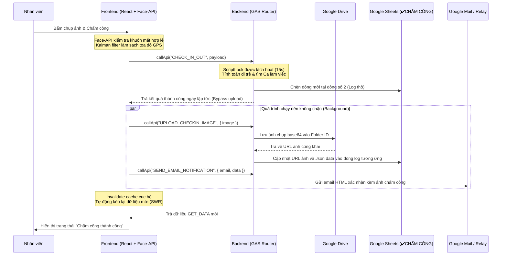

# CORE WEBAPP ARCHITECTURE - KING'S GRILL STAFF OS

Tài liệu này phân tích chi tiết kiến trúc lõi, cấu trúc dữ liệu, luồng nghiệp vụ, API, và các điểm kết nối kỹ thuật của dự án **King's Grill Staff OS** (dự án `kg-checkin`). Đây là tài liệu kỹ thuật nền tảng phục vụ cho việc tái thiết kế và nâng cấp giao diện mới ở các bước tiếp tioheo mà không phá vỡ logic xử lý hiện tại.

---

## A. Tổng Quan Hệ Thống

**King's Grill Staff OS** là một hệ điều hành nhân sự và vận hành nội bộ dành cho nhân viên và quản lý nhà hàng. Hệ thống tích hợp chấm công, quản lý ca trực, phân phối công việc, giao nhận ca, gamification và quản lý công lương dựa trên hạ tầng đám mây không máy chủ (Serverless).

### 1. Các nhóm chức năng chính:
- **Xác thực & Bảo mật:** Đăng ký, đăng nhập, khôi phục mật khẩu qua email OTP, phân quyền theo vai trò (Role) và bộ phận (Position).
- **Chấm công thông minh:** Chấm công GPS (định vị bán kính hợp lệ), kiểm tra Face ID (Face API client-side), tính giờ đi trễ tự động, tự động phạt tiền đi trễ, đồng bộ hóa ảnh minh chứng lên Google Drive và gửi email xác nhận.
- **Quản lý lịch trực & Đổi ca:** Đăng ký lịch làm việc tuần, phê duyệt lịch tập trung của Admin, chợ đổi ca trực tuyến (Swap Shifts) có sự phê duyệt của Admin hoặc đồng thuận của đồng nghiệp.
- **Vận hành nhà hàng:** Checklist công việc đầu ca/cuối ca, bàn giao ca & báo cáo sự cố (Handover & Incidents), báo cáo món hết (Sold Out) thời gian thực.
- **Quản lý công lương & Tài chính:** Bảng công chi tiết (Timesheet), phiếu lương hàng tháng (Payroll), yêu cầu ứng lương (Advance) duyệt tự động/thủ công, ghi nhận thưởng phạt chuyên cần.
- **Đào tạo & Góp ý:** Tài liệu đào tạo SOP, thi trắc nghiệm (Training Quiz), khảo sát trạng thái tâm lý đầu ca (Pulse Survey), đóng góp ý kiến ẩn danh/công khai.
- **Gamification (King Coins):** Tích điểm King Coins từ hành vi chấm công đúng giờ, hoàn thành checklist, và trừ điểm khi đi trễ. Bảng xếp hạng thi đua (Leaderboard).
- **Trợ lý AI:** Chatbot hỗ trợ giải đáp quy định nhà hàng tích hợp mô hình ngôn ngữ lớn (LLM Groq API) với Prompts cấu hình động.

### 2. Công nghệ sử dụng:
- **Frontend:** React (Vite) + TypeScript + Zustand (State Management) + TailwindCSS (Styling) + Lucide Icons.
- **Backend (API Router):** Google Apps Script (GAS) Web App xử lý yêu cầu HTTP POST qua endpoint duy nhất (`doPost`).
- **Database/Storage:** Google Sheets (Spreadsheet) lưu trữ bảng biểu, Google Drive lưu trữ tệp tin hình ảnh chấm công/avatar.
- **Integrations:** Google Maps Geocoding (chuyển đổi tọa độ thành địa chỉ tiếng Việt), Nominatim OSM (dự phòng geocode), MailApp/GmailApp (gửi báo cáo email), Groq API (AI Chatbot).

---

## B. Cấu Trúc Thư Mục và File

| File/Thư mục | Vai trò | Phần lõi liên quan | Ghi chú |
| :--- | :--- | :--- | :--- |
| **`gas/`** | Thư mục mã nguồn Backend chạy trên Google Apps Script. | Toàn bộ logic Backend | Đóng vai trò là Database Server & API Router. |
| `gas/Code.gs` | Khởi tạo cấu hình hệ thống, định tuyến API (`doPost`), quản lý trigger tự động hóa và gửi mail báo cáo hàng ngày. | API Routing, CONFIG, Trigger | File cấu hình gốc, tuyệt đối không đổi tên. |
| `gas/Engine.gs` | Chứa logic cốt lõi về xử lý bảng công, chuẩn hóa thời gian và tính toán dữ liệu chấm công hàng loạt từ log thô sang sheet tổng hợp. | Xử lý bảng công, Công thức lương | Sử dụng Google Sheets API V4 để ghi dữ liệu hàng loạt. |
| `gas/Handlers.gs` | Chứa tất cả các hàm xử lý API riêng biệt cho từng nghiệp vụ (Check-in, đổi ca, checklist, lương...). | Business Logic, Đọc/Ghi Sheets | File backend lớn nhất (>2600 dòng), điều phối toàn bộ nghiệp vụ. |
| `gas/appsscript.json`| Tệp cấu hình phân quyền của Apps Script. | API Scopes, Permissions | Khai báo quyền truy cập Drive, Mail, Spreadsheet và External Fetch. |
| **`gas-relay/`** | Project GAS phụ dùng làm Email Relay để vượt giới hạn quota gửi mail hàng ngày của Google (100 mails/day). | Gửi email thông báo | Nhận payload mã hóa từ dự án chính và chuyển tiếp email. |
| **`src/services/`** | Dịch vụ gọi API. | Lớp kết nối HTTP | |
| `src/services/api.ts` | Triển khai hàm `callApi` gọi đến GAS Web App URL, hỗ trợ tự động retry khi lỗi mạng và chống gọi trùng lặp (inFlight calls). | Kết nối API | URL endpoint được lưu trong `localStorage` (`kg_gas_url`) hoặc `.env`. |
| **`src/store/`** | Quản lý trạng thái ứng dụng. | State Management | |
| `src/store/useAppStore.ts`| Định nghĩa Zustand Store duy nhất chứa toàn bộ State của Webapp (User, Logs, GPS, Shifts, Payroll, Checklist...). | Global State, Actions | Điểm tập trung dữ liệu của toàn bộ Frontend. |
| **`src/utils/`** | Thư mục chứa các hàm tiện ích. | Helper & Security | |
| `src/utils/refreshData.ts`| Triển khai mô hình SWR (Stale-While-Revalidate) và Mega-Fetch (Mega-Fetch) để tải đồng bộ dữ liệu trạng thái nhanh chóng. | Caching, Hydration | Đọc/Ghi dữ liệu tạm thời vào `localStorage`. |
| `src/utils/permissions.ts`| Triển khai RBAC (Role and Position Based Access Control) để ẩn/hiện các tab chức năng dựa trên chức vụ và phân quyền. | Phân quyền Client | Phân biệt quyền Admin/Tester và chức vụ phục vụ/bếp/bảo vệ. |
| `src/utils/helpers.ts` | Chứa các hàm tính toán khoảng cách GPS, định dạng ngày giờ, tính toán nhãn tuần làm việc và Text-to-Speech (`speak`). | Utilities | |
| `src/utils/kalman.ts` | Bộ lọc Kalman lọc nhiễu tọa độ định vị GPS tránh nhảy vị trí ảo khi nhân viên chấm công. | Lọc nhiễu GPS | Lọc nhiễu trực tiếp trên tọa độ nhận về. |
| `src/utils/security.ts` | Hàm mã hóa payload và kiểm soát bảo mật Client. | Security | |
| **`src/pages/`** | Chứa các view/trang chức năng của Webapp. | Lớp Giao Diện | |
| `src/pages/CheckIn.tsx` | Thực hiện Face Detection (Face-API client-side), kiểm tra GPS và gửi dữ liệu chấm công. | Chấm công | Gọi `CHECK_IN_OUT`, `UPLOAD_CHECKIN_IMAGE`, `SEND_EMAIL_NOTIFICATION`. |

---

## C. Kiến Trúc Lõi Của Webapp

Kiến trúc hiện tại được chia làm 5 lớp rõ rệt:

```
┌─────────────────────────────────────────────────────────────────┐
│                    LỚP GIAO TIỆP NGƯỜI DÙNG                     │
│  - React Pages & Components (Checkin, Checklist, Payroll...)    │
│  - Phân quyền giao diện dựa trên permissions.ts (RBAC)          │
└────────────────────────────────┬────────────────────────────────┘
                                 │ Đọc/Ghi State
┌────────────────────────────────▼────────────────────────────────┐
│                      LỚP XỬ LÝ NGHIỆP VỤ                        │
│  - Zustand Store (useAppStore.ts) làm trung tâm trạng thái      │
│  - Lớp đồng bộ SWR (refreshData.ts) quản lý cache localStorage  │
│  - Bộ lọc nhiễu định vị Kalman Filter                           │
└────────────────────────────────┬────────────────────────────────┘
                                 │ callApi() - HTTP POST (JSON)
┌────────────────────────────────▼────────────────────────────────┐
│                      LỚP GIAO TIẾP API (GAS)                    │
│  - doPost(e) đóng vai trò Router chính trong Code.gs            │
│  - Các Handlers nghiệp vụ chuyên biệt trong Handlers.gs         │
└────────────────────────────────┬────────────────────────────────┘
                                 │ Đọc/Ghi trực tiếp
┌────────────────────────────────▼────────────────────────────────┐
│                          LỚP DỮ LIỆU                            │
│  - Google Sheets đóng vai trò Database chính                    │
│  - CacheService của Google Apps Script (lưu cache GET_DATA 120s)│
│  - DriveApp lưu trữ tệp đa phương tiện (ảnh chụp chấm công)     │
└─────────────────────────────────────────────────────────────────┘
```

1. **Lớp giao tiếp người dùng (UI Layer):** Nhận tương tác của nhân viên, sử dụng camera để chụp ảnh và định vị GPS của trình duyệt. Việc hiển thị hay khóa các chức năng được quyết định bởi `permissions.ts` trước khi component render.
2. **Lớp xử lý nghiệp vụ (Client Logic):** Quản lý luồng dữ liệu cục bộ. Sử dụng mô hình SWR: Khi khởi động ứng dụng, phục hồi dữ liệu cũ từ `localStorage` ra UI ngay lập tức, sau đó gọi API lấy dữ liệu mới trong background để cập nhật đè lên. Tọa độ GPS được đưa qua bộ lọc Kalman để triệt tiêu sai số.
3. **Lớp giao tiếp API (Service/Routing Layer):** Mọi request từ client đều được đóng gói dưới dạng `{ action: "TÊN_ACTION", ...payload }` và gửi đến URL Apps Script Web App qua phương thức POST (Fetch API). Client có cơ chế tự động retry 1 lần sau 600ms đối với foreground request nếu xảy ra lỗi kết nối.
4. **Lớp dữ liệu (Data/Database Layer):** Toàn bộ dữ liệu nằm trên các bảng tính của Google Sheets. Phía Backend sử dụng `LockService` (khóa 15 giây) khi thêm log chấm công mới để tránh xung đột ghi đè ô (Race Condition). Sử dụng `CacheService` để lưu cache kết quả trả về của hàm `GET_DATA` (thời gian sống 120 giây) nhằm giảm số lượng đọc ghi Sheet và tránh vượt giới hạn quota của Google.
5. **Lớp tích hợp bên ngoài (Integration Layer):** Tận dụng hệ sinh thái của Google như Maps Geocoding (dịch tọa độ miễn phí), DriveApp để lưu trữ và public ảnh chấm công dưới dạng URL, MailApp để gửi email tự động đính kèm tệp báo cáo PDF/PNG.

---

## D. Sơ Đồ Luồng Dữ Liệu

### Luồng nghiệp vụ Chấm công (Check-in/out)



---

## E. Danh Sách Chức Năng Lõi

| Chức năng | Mục đích | Hàm/File liên quan | Input | Output | Dữ liệu tác động | Ghi chú |
| :--- | :--- | :--- | :--- | :--- | :--- | :--- |
| **LOGIN** | Xác thực người dùng đăng nhập | `handleLogin` (Handlers.gs) | `username`, `password` | `{ ok, data: User }` | Đọc sheet `DATA` | Có tài khoản test bypass: `testapp`/`123456`. |
| **REGISTER** | Đăng ký tài khoản nhân sự mới | `handleRegister` (Handlers.gs) | `username`, `password`, `fullname`, `dob`, `email` | `{ ok, message }` | Ghi sheet `DATA` | Tài khoản mặc định có role='user', position='Phục vụ'. |
| **FORGOT_PASSWORD** | Gửi OTP & Đặt lại mật khẩu | `handleRequestOTP`, `handleResetPassword` (Handlers.gs) | `email`, `otp`, `newPassword` | `{ ok, message }` | Đọc/Ghi sheet `OTPs` và cập nhật sheet `DATA` | OTP có hiệu lực trong vòng 5 phút (300,000ms). |
| **CHECK_IN_OUT** | Chấm công vào/ra ca trực | `handleCheckInOut` (Handlers.gs) | `username`, `fullname`, `type`, `lat`, `lng`, `distance`, `location`, `image='PENDING'` | `{ ok, data: { timeISO, shift, lateMins, checklistPending } }` | Ghi sheet `✔️CHẤM CÔNG`, `BonusPenalty`, `KING_COINS` | Có cơ chế tự động phạt lương khi đi trễ > 5p và phạt King Coins. |
| **UPLOAD_CHECKIN_IMAGE**| Tải ảnh chấm công ngầm | `handleUploadCheckinImage` (Handlers.gs) | `fullname`, `timeISO`, `image` (base64) | `{ ok, data: { url } }` | Ghi Drive & Cập nhật cột ảnh sheet `✔️CHẤM CÔNG` | Tìm và cập nhật chính xác dòng log thông qua `timeISO` trong trường JSON. |
| **GET_DATA** | Tải dữ liệu ban đầu/làm mới | `handleGetData` (Handlers.gs) | `username`, `fullname`, `role`, `monthSheet`, `weekLabel`, `forceRefresh` | `{ ok, data: MegaFetchObject }` | Đọc nhiều sheet: `Logs`, `Users`, `API_Keys`, `Chat`, `Schedules`... | Sử dụng CacheScript 120 giây. Giới hạn chỉ đọc 200 dòng logs cuối. |
| **REGISTER_SHIFT** | Đăng ký lịch làm việc tuần | `handleRegisterShift` (Handlers.gs) | `fullname`, `monthSheet`, `weekLabel`, `shifts` (mảng 7 ngày), `reason` | `{ ok, message }` | Ghi sheet `Tháng MM/YYYY` | Chèn dòng đăng ký mới dưới Header Tuần tương ứng. |
| **APPROVE_SCHEDULES** | Duyệt lịch trực của nhân viên | `handleApproveSchedules` (Handlers.gs) | `monthSheet`, `weekLabel`, `schedules` (danh sách đã duyệt) | `{ ok, message }` | Ghi sheet `Tháng MM/YYYY` | Tạo dòng duyệt có ký hiệu `┗ [Tên nhân viên]` tô màu xanh đặc trưng. |
| **SUBMIT_SWAP** | Gửi yêu cầu đổi ca làm việc | `handleSubmitSwap` (Handlers.gs) | `username`, `fullname`, `dayName`, `shift`, `date`, `reason` | `{ ok, data: SwapRequest }` | Ghi sheet `SwapRequests` | Tạo trạng thái `Pending_User` hoặc `Pending_Admin`. |
| **APPROVE_SWAP** | Quản lý phê duyệt đổi ca | `handleApproveSwap` (Handlers.gs) | `id`, `status` ('Approved'/'Rejected'), `adminUsername` | `{ ok, message }` | Cập nhật sheet `SwapRequests` & sheet `Tháng MM/YYYY` | Khi duyệt thành công, backend tự động cập nhật đè ca làm việc trong sheet lịch biểu. |
| **SUBMIT_CHECKLIST** | Ghi nhận kết quả checklist | `handleSubmitChecklist` (Handlers.gs) | `username`, `fullname`, `date`, `shift`, `checkedTasks` (mảng ID) | `{ ok, message }` | Ghi sheet `ChecklistLogs` & ghi nhận King Coins thưởng | Tính điểm cộng/phạt và tự động ghi vào sheet `KING_COINS`. |
| **SUBMIT_HANDOVER** | Bàn giao ca & báo cáo sự cố | `handleSubmitHandover` (Handlers.gs) | `username`, `fullname`, `date`, `shift`, `content`, `image` | `{ ok, message }` | Ghi sheet `Handovers` & tải ảnh lên Drive | Dành cho các chức vụ quản lý và vận hành chính. |
| **SUBMIT_ADVANCE** | Yêu cầu ứng lương | `handleSubmitAdvance` (Handlers.gs) | `username`, `fullname`, `amount`, `reason` | `{ ok, data: AdvanceRequest }` | Ghi sheet `Advances` | Trạng thái ban đầu là `Pending`. |
| **GET_PAYROLL** | Xem bảng lương & tính toán | `handleGetPayroll` (Handlers.gs) | `username`, `role`, `month` | `{ ok, data: PayrollRecord[] }` | Đọc sheet lương & tổng hợp công | Tính toán thực nhận dựa trên giờ công, ứng, thưởng/phạt. |

---

## F. Mô Hình Dữ Liệu (Google Sheets Database)

Database của Webapp là một file Google Spreadsheet chứa các Sheet (bảng) cấu trúc sau:

### 1. Sheet: `DATA` (Danh sách nhân viên)
*Lưu thông tin tài khoản và hồ sơ nhân sự.*
| Cột | Tên trường | Ý nghĩa | Kiểu dữ liệu | Bắt buộc | Ghi chú |
| :--- | :--- | :--- | :--- | :--- | :--- |
| A | Username | Tên đăng nhập | String (Unique) | **Có** | Khóa chính |
| B | Password | Mật khẩu tài khoản | String | **Có** | Lưu text thô |
| C | FullName | Họ và tên nhân viên | String | **Có** | Dùng để hiển thị và đối khớp |
| D | DOB | Ngày sinh | String (dd/MM/yyyy) | Không | |
| E | Email | Email cá nhân | String | **Có** | Dùng nhận OTP và báo cáo chấm công |
| F | Role | Phân quyền hệ thống | String | **Có** | Các giá trị: `admin`, `tester`, `user` |
| G | Position | Chức vụ/Bộ phận | String | **Có** | Ví dụ: `Phục vụ`, `Bếp`, `Thu ngân`... |
| H | AvatarUrl | Đường dẫn ảnh đại diện| String | Không | Link ảnh Drive thumbnail |

### 2. Sheet: `✔️CHẤM CÔNG` (Log chấm công thô)
*Lưu toàn bộ lịch sử chấm công vào/ra của nhân viên.*
| Cột | Tên trường | Ý nghĩa | Kiểu dữ liệu | Bắt buộc | Ghi chú |
| :--- | :--- | :--- | :--- | :--- | :--- |
| A | Họ và Tên | Họ và tên nhân viên | String | **Có** | Liên kết với `FullName` trong sheet `DATA` |
| B | Loại Chấm Công | Loại hình và trạng thái trễ| String | **Có** | Ví dụ: `Vào ca`, `Vào ca (Trễ 15p)`, `Ra ca` |
| C | Thời Gian | Thời điểm chấm công | String (dd/MM/yyyy HH:mm:ss) | **Có** | Được chuẩn hóa tự động ở phía backend |
| D | Vị Trí | Địa chỉ thực tế | String | **Có** | Địa chỉ dịch ngược từ tọa độ |
| E | Xác Minh | Trạng thái hợp lệ GPS | String | **Có** | Các giá trị: `Hợp lệ`, `Không hợp lệ` |
| F | Khoảng Cách | Khoảng cách tới nhà hàng | String (VD: "12m") | **Có** | Tính bằng mét |
| G | Link Hình Ảnh | Đường dẫn ảnh minh chứng | String | **Có** | Ban đầu là "Đang tải ảnh...", cập nhật sau |
| H | JSON | Gói dữ liệu thô | String (JSON) | **Có** | Cột ẩn, dùng làm sao lưu dữ liệu gốc |

### 3. Sheet: `Tháng MM/YYYY` (Lịch trực tuần)
*Bảng chấm công và đăng ký ca theo từng tháng. Được tạo tự động dựa trên tháng chủ đạo.*
- **Cột A:** Chứa tên nhân viên hoặc nhãn tuần (Ví dụ: `📅 TUẦN 20/04 - 26/04`).
- **Dòng Duyệt ca:** Có ký hiệu đặc biệt `┗ [Tên nhân viên]` ở cột A để phân biệt với dòng đăng ký ca của nhân viên.
- **Cột B -> H (Thứ 2 -> Chủ nhật):** Ca làm việc (Ví dụ: `15:00`, `08:00`, `OFF`, `17:00#`...). Ký hiệu `#` biểu thị ca đêm.
- **Cột I (Ghi chú):** Lý do off hoặc ghi chú đăng ký.
- **Cột J (Thời gian):** Timestamp nộp đăng ký/thời gian duyệt.
- **Cột K (Trạng thái):** Trạng thái duyệt ca (`Chờ duyệt`, `Đã duyệt`, `Đã điều chỉnh`).

### 4. Sheet: `Advances` (Yêu cầu ứng lương)
| Cột | Ý nghĩa | Kiểu dữ liệu | Ghi chú |
| :--- | :--- | :--- | :--- |
| A | ID yêu cầu | String | Khóa chính sinh tự động |
| B | Username | String | Người yêu cầu |
| C | FullName | String | Tên hiển thị |
| D | Số tiền ứng | Number | Đơn vị: VNĐ |
| E | Lý do ứng | String | |
| F | Thời gian tạo | Number | Timestamp miliseconds |
| G | Trạng thái | String | `Pending` (Chờ duyệt), `Approved` (Đã duyệt), `Rejected` (Từ chối) |

---

## G. Hệ Thống Endpoints API (Backend)

Hệ thống sử dụng một endpoint duy nhất thông qua hàm `doPost(e)` nhận gói tin JSON POST. Phục vụ các action chính sau:

| Action | API Handler | Đọc/Ghi dữ liệu | Quyền yêu cầu | Ghi chú |
| :--- | :--- | :--- | :--- | :--- |
| `LOGIN` | `handleLogin` | Đọc | Tất cả | Xác thực tài khoản nhân sự. |
| `REGISTER` | `handleRegister` | Ghi | Tất cả | Tạo mới tài khoản mặc định. |
| `CHECK_IN_OUT` | `handleCheckInOut` | Đọc/Ghi | Tất cả | Chèn log chấm công thô, tự động phạt nếu đi trễ. |
| `UPLOAD_CHECKIN_IMAGE`| `handleUploadCheckinImage`| Ghi | Tất cả | Tải ảnh lên Google Drive, cập nhật liên kết log. |
| `SEND_EMAIL_NOTIFICATION`| `handleSendEmailNotification`| Không | Tất cả | Gửi email thông báo ca trực cho nhân sự. |
| `GET_DATA` | `handleGetData` | Đọc | Tất cả | MEGA-FETCH: Trả về trạng thái tổng thể (Có cache). |
| `REGISTER_SHIFT`| `handleRegisterShift`| Ghi | Tất cả | Đăng ký ca làm việc cho tuần làm việc mới. |
| `APPROVE_SCHEDULES`| `handleApproveSchedules`| Ghi | Admin/Tester | Duyệt hàng loạt ca làm việc của nhân sự. |
| `SUBMIT_SWAP` | `handleSubmitSwap` | Ghi | Tất cả | Đăng yêu cầu đổi ca trực lên hệ thống. |
| `APPROVE_SWAP` | `handleApproveSwap` | Đọc/Ghi | Admin/Tester | Duyệt yêu cầu đổi ca trực và cập nhật lịch gốc. |
| `SUBMIT_CHECKLIST`| `handleSubmitChecklist`| Ghi | Tất cả | Ghi log hoàn thành checklist và cộng King Coins. |
| `SUBMIT_HANDOVER`| `handleSubmitHandover`| Ghi | Quản lý/Bếp trưởng| Bàn giao ca trực, lưu trữ báo cáo công việc. |
| `GET_PAYROLL` | `handleGetPayroll` | Đọc | Tất cả | Đọc và tính toán bảng lương thực nhận cuối kỳ. |
| `SYNC_KEYS` | `handleSyncKeys` | Ghi | Admin/Tester | Đồng bộ danh sách API Keys phục vụ AI Chatbot. |

---

## H. Luồng Nghiệp Vụ Chính

### 1. Luồng xử lý Chấm công đi trễ và Phạt tự động
- **Bước 1:** Nhân viên chụp ảnh thành công -> Frontend xác định tọa độ GPS hợp lệ và gửi yêu cầu `CHECK_IN_OUT`.
- **Bước 2:** Backend nhận yêu cầu, truy vấn lịch biểu đã duyệt (`┗ [Tên nhân viên]`) tại sheet tháng hiện tại để lấy giờ ca trực ngày hôm đó (Ví dụ: ca `15:00`).
- **Bước 3:** So sánh thời gian thực tế máy chủ nhận yêu cầu với giờ ca trực. Nếu trễ hơn 5 phút (Ví dụ: check-in lúc `15:06`):
  - Tính toán số phút đi trễ (`lateMins`).
  - Tự động tạo một bản ghi phạt tiền trong sheet `BonusPenalty` với công thức: `Phạt = Mức phạt cơ bản (10.000đ) cho mỗi block 15 phút đi trễ`.
  - Tự động trừ 10 điểm trong tài khoản King Coins của nhân viên thông qua sheet `KING_COINS`.
  - Gửi thông báo cảnh báo khẩn cấp hệ thống `warning` cho toàn bộ Admin.
- **Bước 4:** Nếu đi trễ dưới 5 phút hoặc đúng giờ, hệ thống ghi nhận hợp lệ và tự động cộng 5 điểm thưởng King Coins.

### 2. Luồng nộp lịch trực và Phê duyệt của Admin
- **Bước 1:** Nhân viên chọn Tab "Đăng ký ca", đăng ký trạng thái trực cho 7 ngày của tuần kế tiếp (Ví dụ: `15:00`, `OFF`...) và bấm nộp.
- **Bước 2:** Backend chèn một dòng đăng ký trực tiếp dưới nhãn tuần tương ứng trong sheet tháng. Trạng thái dòng này là `Chờ duyệt` (Dòng đăng ký thô).
- **Bước 3:** Admin vào giao diện phê duyệt lịch trực, chỉnh sửa ca trực nếu cần thiết và bấm "Phê duyệt".
- **Bước 4:** Backend tạo một dòng duyệt mới nằm ngay dưới dòng đăng ký của nhân viên, bắt đầu bằng ký tự đặc trưng `┗ [Tên nhân viên]`. Chỉ có dữ liệu ca trực trên dòng bắt đầu bằng `┗` mới được hệ thống tính toán làm giờ ca chuẩn để đối chiếu khi chấm công.

---

## I. Trạng Thái, Điều Kiện và State Biến Thiên

| Trạng thái (State) | Ý nghĩa | Nơi khởi tạo | Sự kiện cập nhật | Ảnh hưởng chức năng |
| :--- | :--- | :--- | :--- | :--- |
| **`gps.isValid`** | Tọa độ GPS nằm trong bán kính nhà hàng | Client (CheckIn.tsx) | Sự thay đổi vị trí từ navigator GPS | Chỉ khi `isValid === true`, nút Chấm công mới được kích hoạt. |
| **`isFaceDetected`**| Phát hiện duy nhất 1 khuôn mặt trước camera | Client (CheckIn.tsx) | Bounding box từ Face-API.js | Chỉ khi phát hiện khuôn mặt, nút Chụp ảnh mới khả dụng. |
| **`isScheduleRegistered`**| Trạng thái đăng ký lịch tuần của nhân sự | Server (GET_DATA) | Khi nhân sự bấm nộp ca trực | Nếu `false`, hệ thống sẽ kích hoạt hộp nhắc nhở thông báo khi đăng nhập. |
| **Swap status** | Trạng thái của yêu cầu đổi ca trực | Server (Swap) | Người đổi ca đồng ý -> Admin phê duyệt | Các giá trị: `Pending_User` -> `Pending_Admin` -> `Approved` / `Rejected`. |
| **Advance status**| Trạng thái yêu cầu ứng lương | Server (Advance) | Admin phê duyệt / từ chối | Giá trị: `Pending` -> `Approved` / `Rejected`. Cập nhật vào Payroll cuối tháng. |

---

## J. Phân Quyền và Bảo Mật (RBAC & Security)

### 1. Phân quyền vai trò (Roles):
- **`admin` / `tester`:** Toàn quyền truy cập mọi tính năng trên UI và gọi được tất cả API backend (phê duyệt lương, cấu hình GPS, sửa lịch trực, đồng bộ API Keys).
- **`user`:** Chỉ được phép sử dụng các chức năng chấm công, xem lịch cá nhân, nộp checklist, gửi phản hồi, xem bảng lương của chính mình. Bị chặn hoàn toàn các Tab cấu hình hành chính và bảng điều khiển tổng hợp.

### 2. Phân quyền vị trí công việc (Position-based):
- **Phục vụ, Tổ trưởng, Thu ngân, Bếp, Pha chế:** Được quyền truy cập báo cáo món hết (`soldout`), tài liệu đào tạo (`training`).
- **Quản lý, Tổ trưởng, Thu ngân, Bếp, Pha chế:** Được quyền thực hiện bàn giao ca cuối ca (`handover`).
- **Tạp vụ, Bảo vệ:** Bị ẩn các Tab `soldout`, `handover`, `training` do không thuộc chuyên môn vận hành nhà hàng.

### 3. Cơ chế bảo mật lõi:
- **Master PIN:** API Keys (đặc biệt là Groq LLM Key dùng cho AI Chatbot) được lưu trữ tại sheet `🔑API_KEYS` và được bảo vệ bằng một mã PIN. Chỉ khi client gửi đúng PIN (trong tab Admin), backend mới trả về danh sách Keys thô.
- **Race Condition Protection:** Khi ghi nhận chấm công (`CHECK_IN_OUT`) hoặc ứng lương, backend sử dụng `LockService.getScriptLock()` để khóa tài nguyên ghi trong tối đa 15 giây. Tránh lỗi ghi trùng ô hoặc mất dữ liệu khi nhiều nhân viên bấm chấm công cùng một thời điểm (Ví dụ: lúc giao ca 15:00).
- **Xác thực OTP:** Quá trình khôi phục mật khẩu sử dụng mã OTP ngẫu nhiên 6 chữ số gửi qua email đăng ký của nhân viên, lưu vết thời gian tại sheet `OTPs` và tự động hết hạn sau 5 phút.

---

## K. Cấu Hình Hệ Thống

Các thông số cấu hình cốt lõi được lưu trữ tại sheet `⚙️ CẤU HÌNH` hoặc khai báo hằng số trong `Code.gs`:

| Cấu hình | Giá trị hiện tại | Vị trí lưu trữ | Vai trò | Nhạy cảm |
| :--- | :--- | :--- | :--- | :--- |
| **`SPREADSHEET_ID`**| `1UtDinbNZdOF8LRwxX1SlTKxUBFvr0UG6_iu7NyXDteY` | `Code.gs` | ID Google Sheets đóng vai trò database chính. | Không |
| **`FOLDER_ID`** | `1i1ZQRtprRKVIhO8aF660iR6qd2tMPDTY` | `Code.gs` | ID thư mục Drive lưu ảnh chụp chấm công. | Không |
| **`LOCATION.LAT`** | `10.9760826` | `Code.gs` (Mặc định) / Sheet | Vĩ độ định vị của nhà hàng King's Grill. | Không |
| **`LOCATION.LNG`** | `106.6646541` | `Code.gs` (Mặc định) / Sheet | Kinh độ định vị của nhà hàng King's Grill. | Không |
| **`MAX_DISTANCE`** | `25` (mét) | `Code.gs` (Mặc định) / Sheet | Bán kính tối đa cho phép chấm công hợp lệ. | Không |
| **`EMAILS`** | `["dmt.kgwork@gmail.com", ...]` | `Code.gs` | Danh sách nhận báo cáo tổng hợp công hàng ngày.| Không |
| **`EMAIL_RELAY_URLS`**| `["https://script.google.com/..."]` | `Code.gs` | Endpoint GAS tài khoản phụ nhận chuyển tiếp email. | **Có** (Che) |
| **`EMAIL_RELAY_SECRET`**| `kg-relay-2026` | `Code.gs` | Khóa bảo mật xác thực gói tin giữa các script. | **Có** (Che) |

---

## L. Triggers và Tiến Trình Tự Động Hóa (Automation)

Hệ thống cấu hình một trigger thời gian chạy tự động hàng ngày:

- **Handler Function:** `autoProcessDaily()`
- **Thời gian chạy:** 01:00 AM hàng ngày (Timezone: Asia/Ho_Chi_Minh).
- **Các bước thực hiện:**
  1. Đọc log chấm công của ngày hôm trước trên sheet `✔️CHẤM CÔNG`.
  2. Gọi hàm chuẩn hóa dữ liệu thời gian cột C.
  3. Sử dụng `processTimesheetDataWithDominantMonth` tính toán tổng giờ làm (bao gồm cả nhân ca đêm), giờ tăng ca, số ngày công đạt chuẩn.
  4. Ghi đè kết quả định dạng báo cáo vào sheet `📊 TỔNG HỢP ✔️CHẤM CÔNG` bằng Sheets API V4.
  5. Đăng xuất báo cáo dưới dạng tệp đính kèm PDF và ảnh chụp PNG vùng báo cáo.
  6. Gửi báo cáo hoàn tất qua email cho ban quản lý. Nếu quá trình tổng hợp thất bại, tự động gửi email cảnh báo lỗi hệ thống chi tiết (System Error Alert).

---

## M. Tích Hợp Hệ Thống Bên Ngoài (External Integrations)

- **Google Drive Service (DriveApp):** Lưu trữ ảnh chụp camera base64 của nhân viên dưới dạng tệp JPEG. Ảnh được tự động chuyển chế độ chia sẻ `ANYONE_WITH_LINK` để Frontend có thể truy cập qua URL.
- **Google Maps Geocoding API:** Dịch ngược tọa độ GPS thành địa chỉ đường phố cụ thể tại Việt Nam. Sử dụng miễn phí trực tiếp thông qua lớp đối tượng `Maps` tích hợp sẵn của Google Apps Script.
- **OpenStreetMap (Nominatim):** Công cụ dịch địa chỉ dự phòng. Được gọi qua `UrlFetchApp` nếu dịch vụ Google Maps bị lỗi hoặc vượt giới hạn truy vấn.
- **Groq LLM API:** Cung cấp trí tuệ nhân tạo cho chatbot giải đáp thắc mắc. Client sử dụng khóa API lấy từ backend để thực hiện truy vấn trực tiếp đến máy chủ Groq.
- **Email Relay System:** Khắc phục giới hạn gửi tối đa 100 email một ngày của tài khoản Gmail miễn phí bằng cách định tuyến yêu cầu gửi thư qua các Web App Apps Script phụ của các tài khoản Google khác.

---

## N. Cơ Chế Xử Lý Lỗi Hiện Tại

- **Lỗi định dạng thời gian:** Backend tự động gọi `normalizeTimeColumn` để chuẩn hóa các chuỗi ngày giờ từ `DD/MM/YYYY HH:MM` thành `DD/MM/YYYY HH:MM:SS` trước khi tính toán bảng công nhằm tránh lỗi thư viện parse ngày tháng.
- **Lỗi phân tích Date trong Google Sheets:** Do GAS getValues tự động biến các ô định dạng Giờ thành Date object của năm 1899, backend sử dụng hàm `safeShiftValue` để ép kiểu an toàn về chuỗi định dạng `"HH:mm"` hoặc `"OFF"`.
- **Lỗi tràn bộ nhớ / Timeout:** Hàm `GET_DATA` giới hạn chỉ đọc tối đa 200 dòng chấm công cuối cùng trên sheet thay vì đọc toàn bộ hàng chục ngàn dòng lịch sử để tối ưu hóa thời gian phản hồi API dưới 3 giây.
- **Lỗi mạng phía Client:** Hàm `callApi` sử dụng cấu trúc điều khiển `AbortController` tự động ngắt kết nối (timeout) sau 15 giây đối với background request và 35 giây đối với foreground request để tránh treo giao diện, đồng thời tự động retry lại 1 lần sau 600ms.

---

## O. Các Điểm Phụ Thuộc Giữa Giao Diện (UI) và Lõi (Core Backend)

Để đảm bảo việc thiết kế giao diện mới không làm đứt gãy kết nối với hệ thống Backend, các quy ước và cấu trúc sau đây **bắt buộc phải giữ nguyên**:

### 1. Quy ước đặt tên Action:
Khi gọi `callApi(action, payload)`, giá trị của tham số `action` phải trùng khớp chính xác 100% với các case trong câu lệnh `switch(payload.action)` của hàm `doPost` trong `Code.gs` (Ví dụ: `LOGIN`, `CHECK_IN_OUT`, `SUBMIT_CHECKLIST`...).

### 2. Định dạng dữ liệu gửi đi (Payload structure):
- **Đăng ký ca:** Payload của `REGISTER_SHIFT` phải chứa mảng `shifts` đủ 7 phần tử tương ứng Thứ 2 -> Chủ nhật.
- **Chấm công:** Yêu cầu chấm công phải gửi chuỗi hình ảnh base64 qua `UPLOAD_CHECKIN_IMAGE` kèm khóa kiểm tra trùng khớp `timeISO` giống hệt gói tin phản hồi của `CHECK_IN_OUT`.

### 3. Cấu trúc dữ liệu nhận về (Response structure):
Tất cả API backend luôn trả về cấu trúc chuẩn:
```json
{
  "ok": true, // hoặc false
  "message": "Thông điệp phản hồi từ server",
  "data": { ... } // Gói dữ liệu nghiệp vụ
}
```
*Lưu ý: Phía Frontend mới cần kiểm tra thuộc tính `ok` trước khi truy cập dữ liệu bên trong.*

### 4. Khóa lưu trữ LocalStorage:
Các khóa cache cục bộ không được thay đổi để đảm bảo tính năng SWR hoạt động đúng:
- `kg_user`: Lưu trữ thông tin User đang đăng nhập.
- `kg_gas_url`: Địa chỉ endpoint Web App GAS hiện tại.
- `kg_logs`: Lưu danh sách log chấm công gần nhất.
- `kg_stats`: Lưu thống kê lượt chấm công trong ngày.

---

## P. Checklist Phần Lõi Cần Giữ Nguyên Khi Tạo Giao Diện Mới

- [ ] Giữ nguyên định dạng payload và tên các action gọi API trong `src/services/api.ts`.
- [ ] Bảo toàn logic đồng bộ dữ liệu ngầm (SWR) và Mega-Fetch tại `src/utils/refreshData.ts`.
- [ ] Không thay đổi cơ chế phân quyền chức năng RBAC theo Role/Position tại `src/utils/permissions.ts`.
- [ ] Giữ nguyên cơ chế lọc nhiễu tọa độ Kalman Filter tại `src/utils/kalman.ts`.
- [ ] Đảm bảo giữ nguyên các ký hiệu đặc biệt của lịch trực trên Google Sheets (ký hiệu `┗` ở đầu tên của dòng duyệt, ký hiệu `#` ở cuối ca trực đêm).
- [ ] Bảo toàn logic upload ảnh ngầm 2 bước: Ghi log chấm công thô trước -> trả kết quả thành công cho nhân viên -> tự động tải ảnh lên Drive và cập nhật đè URL ảnh lên Sheets ở tiến trình nền.
- [ ] Duy trì các khóa dữ liệu trong `localStorage` để ứng dụng không bị đăng xuất hoặc mất cấu hình khi cập nhật UI mới.

---

## Q. Đề Xuất Chuẩn Hóa Lõi Trước Khi Xây Dựng Giao Diện Mới

| Đề xuất chuẩn hóa | Lý do | Mức ưu tiên | Rủi ro nếu không làm |
| :--- | :--- | :--- | :--- |
| **1. Tách biệt hoàn toàn Business Logic khỏi UI Components** | Nhiều trang (như `CheckIn.tsx`, `Schedule.tsx`) hiện đang chứa cả code giao diện lẫn logic tính toán thời gian đi trễ, xác định tuần hiện tại. Cần đưa các logic này vào thư mục `src/utils/` hoặc viết các Custom Hooks riêng. | **Cao** | Code giao diện mới sẽ cực kỳ phức tạp, khó bảo trì và dễ xảy ra sai lệch tính toán so với backend. |
| **2. Chuẩn hóa Schema và Kiểu Dữ Liệu (TypeScript Types)** | Hiện tại một số phản hồi từ API (như cấu hình lương, cài đặt tổ chức) chưa có interface TypeScript rõ ràng, đang sử dụng kiểu `any`. | **Trung bình** | Dễ phát sinh lỗi runtime undefined khi giao diện mới truy cập vào các trường dữ liệu động. |
| **3. Xây dựng Data Validator ở Client** | Dữ liệu đầu vào của các form (đặc biệt là đăng ký tài khoản, nộp lịch trực) cần được validate định dạng trước khi gửi API để giảm tải cho GAS Server. | **Trung bình** | Backend sẽ nhận nhiều request rác gây quá tải và làm chậm hệ thống. |
| **4. Đồng bộ hóa Timezone tập trung** | Đảm bảo định dạng giờ gửi từ Client và định dạng giờ xử lý trên Google Sheets luôn đồng bộ múi giờ `Asia/Ho_Chi_Minh` để tránh lệch múi giờ trên các thiết bị di động khác nhau. | **Cao** | Lệch múi giờ dẫn đến tính toán đi trễ sai lệch hoặc lệch ngày công của nhân viên. |
